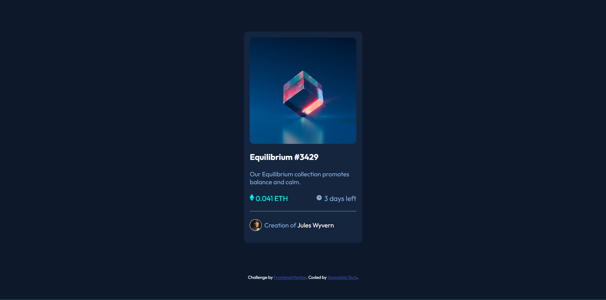
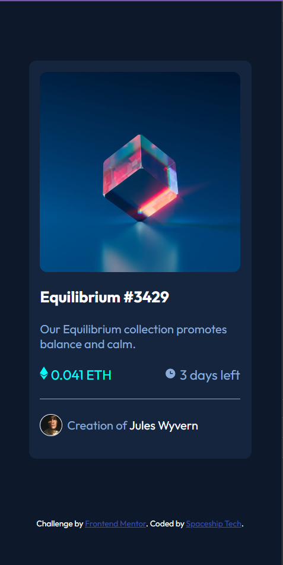

# Frontend Mentor - NFT preview card component solution

This is a solution to the [NFT preview card component challenge on Frontend Mentor](https://www.frontendmentor.io/challenges/nft-preview-card-component-SbdUL_w0U). Frontend Mentor challenges help you improve your coding skills by building realistic projects. 

## Table of contents

- [Overview](#overview)
  - [The challenge](#the-challenge)
  - [Screenshot](#screenshot)
  - [Links](#links)
- [My process](#my-process)
  - [Built with](#built-with)
  - [What I learned](#what-i-learned)
  - [Continued development](#continued-development)
  - [Useful resources](#useful-resources)
- [Author](#author)


## Overview

### The challenge

Users should be able to:

- View the optimal layout depending on their device's screen size
- See hover states for interactive elements

### Screenshot





### Links

- Solution URL: [Solution URL here](https://github.com/Gbollly/nft-preview-card.git)
- Live Site URL: [Live site URL here](https://gbollly.github.io/nft-preview-card/)

## My process

### Built with

- Semantic HTML5 markup
- CSS custom properties
- Flexbox
- CSS Grid


### What I learned

Use this section to recap over some of your major learnings while working through this project. Writing these out and providing code samples of areas you want to highlight is a great way to reinforce your own knowledge.

To see how you can add code snippets, see below:

```html
<main>Some HTML code I'm proud of</main>
```
```css
.avatar > img {
  float: right;
}
```


### Continued development

I would like to focus moree on the image hover effect styling.


### Useful resources

- [Example resource 1](https://www.w3schools.com) - This helped me to give a clear explanation of image hover effect. I really liked this pattern and will use it going forward.


## Author

- Website - [Spaceship Tech](https://www.your-site.com)
- Frontend Mentor - [@gbolly](https://www.frontendmentor.io/profile/gbolly)
- Twitter - [@lukedigital1](https://www.twitter.com/lukedigital1)

